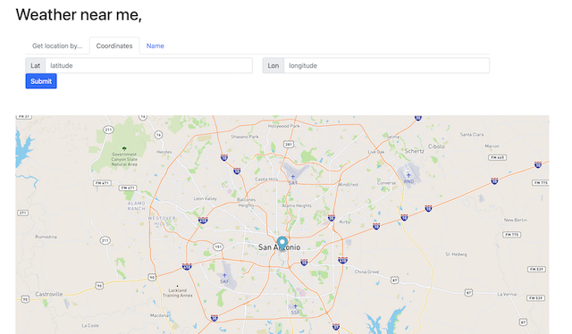

# MyWeather - Weather Application

## Table of contents

- [Overview](#overview)
    - [About The Project](#About-the-project)
    - [Screenshot](#screenshot)
    - [Links](#links)
- [My Process](#my-Process)
    - [Built With](#built-with)
    - [What I Learned](#what-i-learned)
    - [Useful Resources](#useful-resources)
- [Author](#author)

## Overview

### About The Project

This is an interactive weather forecasting application that allows users to obtain a five-day weather forecast based on their geolocation inputs. The default starting location is San Antonio, Texas. As something fun to try, input the name of your favorite sports team's stadium or the name of your Alma Mater to the 'city' searchbar. (ex: Stamford Bridge, LSU etc.)

Users should be able to:

- Make geolocation inputs via coordinates, address, or name of a desired location
- See the name of their location input
- View the 5-day forecast of their geolocation inputs
- Set a map marker with double-click to generate weather forecast from map marker location
- Drag map marker to a location and generate weather forecast from map marker location
- View map location change with user inputs

### Screenshot

 

### Links

- [GitHub repo](https://github.com/radicaladi/weather-application.io)
- [Live URL](https://radicaladi.github.io/weather-application.io/)

(<a href="#top">back to top</a>)

## My Process

### Built With

- Semantic HTML5 markup
- Javascript 
- jQuery
- Mapbox
- OpenWeatherMap
- Bootstrap 5
- Flexbox

### What I Learned

- I learned how to utilize jQuery to make practical Ajax GET requests to an API. Then apply Javascript and jQuery to access the JSON received from two separate APIs and render said data to a webpage in html markup that implements bootstrap class elements. The two requests are asynchronous but by tethering one to the other, I seamlessly integrate each API to develop a practical user-friendly web application. I also explored unfamiliar API libraries and learned how to implement the documentation of each to make a functional application that is as user-friendly as possible.

### Continued Development

- Performing common DOM manipulations with jQuery. 
- Using jQuery and Javascript to render html markup with bootstrap class elements from js file. 
- Styling with Bootstrap and Flexbox for a convenient user experience. 
- As well as fundamental HTML and CSS page structuring practice.

### Useful Resources

- [CSS-Tricks](https://css-tricks.com)
- [Mapbox Docs](https://docs.mapbox.com/api/maps/)
- [OpenWeather Docs](https://openweathermap.org/forecast5)

## Author

- GitHub - [@radicaladi](https://github.com/radicaladi)
- LinkedIn - [@adrianbrown](https://www.linkedin.com/in/adrian-brown-b84b63127/)

(<a href="#top">back to top</a>)

